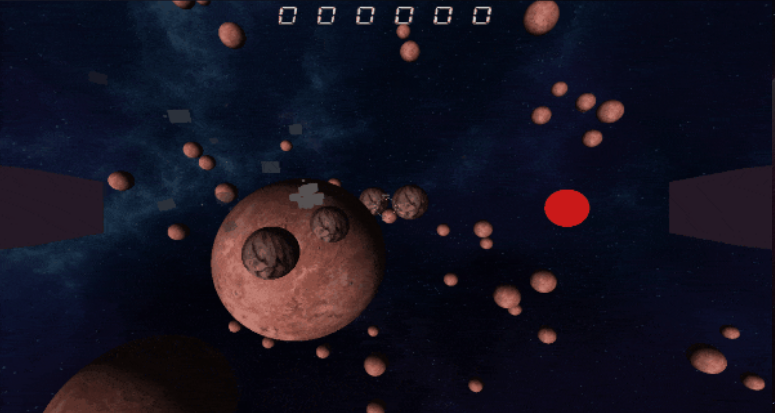

# Views

This project first started as a 3 weeks long school project. 
The goal of this project was to learn DirectX12 and C++ through a complex project. 
It was made with the help of :
* [Hugo Maestracci](https://github.com/sh4dy01)
* [Nathanael Vogt](https://github.com/Gotvna)
* [Theo Da Silva](https://github.com/Sinozer)

## What was made during those first 3 weeks
The goal of these first weeks was to create a 3D space shooter game. The main goal was to
learn DirectX12 rendering and how to create a game engine.

### Engine features
#### Rendering
The Engine rendering contains multiple features :
* A custom shader system, we can create different shader class linked to different .hlsl files
  * Texture rendering
  * Directional lighting
* Each shader is bound to a material, bindable to a MeshRenderer
* Particle system with custom particle shader
* Primitive Mesh creation and rendering 
* Different renderers to render different types of things 
  * MeshRenderer for 3D models
  * ParticleRenderer for particles
  * SkyboxRenderer for skyboxes
  * UIRenderer for UI elements

#### ECS
The Engine is based on an ECS system. It contains multiple features :
* Entity creation and destruction
* Component creation and destruction
  * Example : Transform, MeshRenderer, ParticleSystem, etc...
  * Each component knows the entity it is linked to and the entity's transform

#### Physics
The Engine contains a custom physics engine. It contains multiple features :
* Sphere vs Sphere collision detection
* Space partitioning with classic grid
* Bitmask to know which entities can collide with which

### Game features
#### Gameplay
The game is a 3D space shooter. The player controls a spaceship and has to destroy asteroids.
* The player moves is 3 dimensions without any camera lock
* The player can shoot lasers
* The fov changes depending on the player's speed
* Waves of asteroids spawn at regular intervals
* The player can die and respawn

## What was made after those first 3 weeks
***TBA***